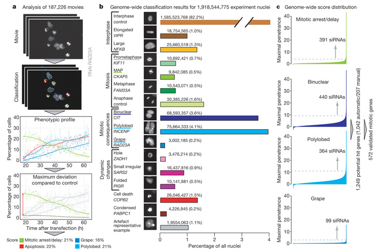

<!--
library("rmarkdown");render("knn_ml_intro.Rmd");knitr::purl("knn_ml_intro.Rmd")
-->


```{r style, echo=FALSE, results="asis", cache=FALSE}
library("knitr")
options(digits = 2, width = 80)
golden_ratio <- (1 + sqrt(5)) / 2
opts_chunk$set(echo = TRUE, tidy = FALSE, include = TRUE,
               dev=c('png', 'pdf', 'svg'), fig.height = 5, fig.width = 4 * golden_ratio, comment = '  ', dpi = 300,
cache = TRUE)
```


 **LAST UPDATE AT**

```{r, echo=FALSE, cache=FALSE}
print(date())
```


# Preparations

We first set global chunk options and load the
necessary packages and the data.

```{r setup, cache = FALSE}
library("rmarkdown")
library("BiocStyle")
library("magrittr")
library("stringr")
library("ggthemes")
library("scales")
library("ggbeeswarm")
library("factoextra")
library("tidyverse")
library("readxl")
library("ggrepel")
library("RColorBrewer")
library("mlr")
library("psych")

set.seed(789)

theme_set(theme_solarized(base_size = 18))
```


# Introduction

In this tutorial, we will import data from a [high content screen](https://en.wikipedia.org/wiki/High-content_screening) performed
on [HeLA](https://en.wikipedia.org/wiki/HeLa)^[HeLA cells are a human cell line]
cells in 96 well plates 
over a time course.

 

[siRNAs](https://en.wikipedia.org/wiki/Small_interfering_RNA) have been added to a subset of the  wells in order to inhibit the activity
of certain genes. The cells where then imaged and their (phenotype)[https://en.wikipedia.org/wiki/Phenotype] recorded ([phenotypic screening](https://en.wikipedia.org/wiki/Phenotypic_screening)).

The input data that we are going to use contains phenotypic class labels for 
each single cell. We want to use these class labels as features 
which in order to predict whether a well has been treated or not.

These phenotypic classes of the single cells
have been obtained using a machine  learning algorithm based on the original image 
features. The data produced is similar to the one in @Neumann_2010^[[Link to the Neumann et. al. paper](http://dx.doi.org/10.1038/nature08869)]: 
Each cell is classified into a mitotic phenotype class:

 

The siRNAs have used in the screen target genes that are known to be important
in the regulation of [mitotis](https://en.wikipedia.org/wiki/Mitosis). Thus,
"negative" wells and wells treated with siRNAs should show notably different
phenotypes.

# Data Processing

This part is might be interesting, but is not essential to understand 
for the machine learning part.

## Annotation import

We first import the annotation of the plate. This consists of table that informs
us about the content of each well on the plate. A well can be transfected with an siRNA
targeting a certain gene, it can be empty, contain scrambled siRNAs or negative
controls.

```{r importAnnotation}
plate_map <- read_excel("plate_mapping.xlsx")
plate_map
```


## Raw data import

We will now import the raw data. This data was originally stored in a variant of the [HDF5 format](https://en.wikipedia.org/wiki/Hierarchical_Data_Format) called
[CellH5](http://www.cellh5.org/),
which defines a more restricted sub--format designed specifically to store data
from high content screens. More information can be found in the paper by 
@Sommer_2013.


Here, we import the data in convenient format: We have the data summarized across
time points (via a sum of counts in the individual time points),
where each column corresponds 
to a well and each row to a phenotypic class.

This is a typical example of a "wide" data table, where the variables 
contained in the data set spread across multiple columns. 

```{r importDataTable, eval=TRUE}
load("raw_data.RData")
```


## Reshaping the screen data and joining the plate annotation

We now reshape the input data, which is in a long format into a wide format.
For this, we first turn the row names into an explicit column and then "gather"
all the columns representing wells. This will turn all the columns that contain
the per--well data into a single "measurement" column that is 
paired with a "key"" column containing the well identifiers.

The result is a "long" data table, which contains one observation per row: in our 
case the number of times a cell was assigned to a specific class in every single
well. Class in combination with well serves as our "key" here, and the class--count
is the associated value.

We now want to join the annotation to this data table in the long format. Before
we can do this, however, we need to solve a subtle problem: Our well identifiers
in the imported data are different from the identifiers in the annotation table
so we cannot easily join the two tables together. 

We first need to strip the lead "W" from the well identifiers and replace the 
"P1" suffix by a "01" suffix. We do this by using a regular expression. Regular
expressions are a powerful tool for the handling of strings and one can find
a nice tutorial about them [here](http://www.zytrax.com/tech/web/regex.htm).

We can now join the annotation to our long table and use the well as the joining
key.

```{r reshape, dependson="import_data_table"}
tidy_raw_data  <- rownames_to_column(as.data.frame(raw_data), 
                                     var = "class") %>%
                  gather(key = "well", value = "count", -class)

tidy_raw_data

tidy_raw_data$well <- str_replace(tidy_raw_data$well, "^W([A-H][0-9]{2})_P1", "\\1_01")

#join annotation

input_data <- left_join(tidy_raw_data, plate_map, by = c("well" = "Position"))

input_data
```


## Grouping, summarizing and data transformation

Before we can can continue with the data analysis 
, we have to make sure that the variables that
we have obtained for every single well are normalized. As our data consists
of the number of cells in each phenotypic category, a straightforward normalization 
consists of transforming the counts into percentages by dividing the data
for each well by its total number of cells.

In the code chunk below, we  use the `group_by()` function 
to partition the  dataset into groups according to the well ID. 
We then apply the function `sum()` to the counts of each well and
use `summarize()` to obtain a table of counts per well. This is an example
of a __split--apply--combine__ strategy.


We can now join the table containing the sums to the original
data and compute compute percentage using the sums.

As Machine Learning and other techniques usually 
work best on data that is on normal distribution (z--score) scale,
we perform a [logit](https://en.wikipedia.org/wiki/Logit) transformation 
to turn the percentages
into z--scores. This is similar in spirit to a log transformation on
intensity values.


```{r groupingAndSummarizing, dependson="reshape"}

no_cells_per_well <- input_data %>%
                     group_by(well) %>%
                     dplyr::summarize(no_cells = sum(count))

no_cells_per_well

data_with_sums <-  left_join(input_data, no_cells_per_well)

data_processed <- mutate(data_with_sums, perc = count / no_cells, 
                       z_score = logit(perc))

data_processed
```

Here, we use the chaining/piping operator `%>%` to "pipe" the result of a 
computation into the next. This leads to more digestible code compared to e.g. loops. 


# Input data after pre--processing

The input data contains the screen annotation as well as 
the [logit](https://en.wikipedia.org/wiki/Logit)--transformed class 
percentages per well (in the column `z-score`).

```{r iputDataAfterPreP}
data_processed
```

The classes `ana` and `inter` are control categories of normally cycling
cells, while the other classes correspond to abnormal phenotypes.

## re--spreading and subsetting

We now spread the long table again and discard information not 
needed for ML so that we retain only the features and the 
target variables, i.e. the `Group` column.

```{r getDataForML}
data_for_ML <- select(data_processed, class, Well, Group, z_score) %>%
               spread(class, z_score)
rownames(data_for_ML) <- data_for_ML$Well
data_for_ML$Group %<>% factor(levels = c("neg", "target"))
data_for_ML$Well <- NULL
```


# The classification problem

The screen contains both wells with siRNAs that inhibit certain genes
and wells that contain no / scrambled / negative control siRNAs.
This is encoded in the variable `Group`.

We now want to see whether we can build a machine learning algorithm that
will use the z--scores of the cell--classes as features in order to predict
whether a well has been treated or not. 

To get an idea, whether this is going to be successful, we take a look at the
interphase z-scores. This is a control category, so the "negative" wells
should have higher scores than the "target" ones. 

```{r addClassColumn}
data_for_ML

ggplot(data = data_for_ML, aes(x = Group, y = inter, color = Group)) +
      geom_beeswarm(cex = 3) +
      ggtitle("Interphase z-scores") +
      scale_color_brewer(palette = "Accent")
```

Indeed, the negative wells have a higher "inter" score on average, thus 
"inter" should be an important feature in our classifier. The class--separation
is further discussed in the "interlude" section below, where we reduce 
the dimensionality of the data.

# Interlude: Principal Component Analysis


PCA (Principal component analysis) is a technique to create a low dimensional representation of a high--dimensional data set. In our case we have 10--dimensional
data (10 different phenotype classes) that we will reduce down to two Principal
components. This lower dimensional data is then useful for plotting.

The data we have lives in a ten dimensional space, as every well contains
cells classified into one of ten different classes. In order to produce a succinct
overview of the data, one tries to reduce the dimensionality of the data.
A popular way to do this is to compute new, artificial, variables that 
are a weighted sum of the original variables. The weights are obtained in
such a way that the variables are independent of each other and retain
as much of the original variability (a proxy of information content) as
possible. These new variables are called "principal components" (PCs) of the data. 

## A PCA plot

We can use the function  `prcomp()` to compute the principal components.
We also create a vector `genes`, giving us the gene each of our siRNAs is targeting.

We then create a ggplot object by mapping the first principal component to the 
x-- and the second one to the y--axis. We use the gene names as plotting symbols
and  color the names according to to the gene name (As we have multiple empty wells
as well as multiple siRNAs targeting the same gene).

Furthermore, we specify that the aspect ratio of x and y axis should be equal to 
the ratio of the standard deviation of PC1 to the standard deviation of PC2 so
that the axes represent the same units. This facilitates a correct interpretation 
of the PCA plot: PC1 has more variance than PC2, so the x--axis should 
be longer than the y--axis to reflect the differences in scale.


```{r PCA, dependson="grouping_and_summarizing", fig.cap="PCA plot"}
data_for_PCA <- data_processed %>% 
                dplyr::select(class, well, z_score) %>%
                spread(key = class, value = z_score)

PCA <- prcomp(data_for_PCA[, -1], center = TRUE, scale. = TRUE)


genes <- input_data %>%
         group_by(well) %>%
          dplyr::summarize(gene = unique(`Gene Symbol`))

genes <- ifelse(is.na(genes$gene), "empty", genes$gene)

dataGG = data.frame(PC1 = PCA$x[,1], PC2 = PCA$x[,2],
                    PC3 = PCA$x[,3], PC4 = PCA$x[,4],
                    genes)

pl <- (ggplot(dataGG, aes(x = PC1, y = PC2, color =  genes))
      + geom_text(aes(label = genes), size = I(2))
      + coord_fixed(ratio = (PCA$sdev)[2] / (PCA$sdev)[1])
      + ggtitle("Principal components plot")
      )

pl + scale_color_tableau(palette = "tableau20")
```

We can see, for example, that the control wells cluster together. 
Note that it is easy to turn this plot 
into an interactive version using `ggplotly` from the `r CRANpkg("plotly")`.

```{r plotly, eval=FALSE, fig.width= 4.5, dependson="PCA"}
if(!("plotly" %in% installed.packages()[,1])){
  install.packages("plotly")
}

library(plotly)
ggplotly(pl)
```

## Variable importance for the principal components

The first PC nicely separates wells containing various controls from the ones
treated with siRNAs. As every component is simply a weighted sum of the original 
variables, we can inspect these weights (called "loadings") to see which classes
"drive" the components and try to interpret what we find.

```{r varImp, dependson="PCA"}
loadings <- PCA$rotation[, 1:2]
loadings_gg <- loadings %>%
               as.data.frame() %>%
               rownames_to_column(var = "class") %>%
               dplyr::select(class, PC1, PC2) %>%
               gather( key = "comp", value = "loading", PC1:PC2)
  
ggplot(loadings_gg, aes(x = class, y = loading, fill = class)) +
      facet_wrap( ~ comp) +
      geom_bar(stat = "identity", position = "identity") +
      theme(axis.text.x = element_text(angle = 45, hjust = 1)) +
      scale_fill_brewer(type = "qual", palette = "Set3") 

```

We can see that e.g. the "inter" and the "map/prometa" classes as well as the "apo"
class are important for PC1. The map and prometa classes combined
define cells that are in mitotic delay/arrest, while the interphase class defines
a control category.

So a possible explanation for PC1 would be that it separates
wells with cells in mitotic arrest/delay (or apoptotic cells) from control 
wells with many cells in the interphase phase (c.f. Figure 1 of @Neumann_2010).

The second principal component seems to separate wells that contain mainly
cells in ana--/metaphase from wells that predominantly contains cells with
strange shape phenotypes.

## Correlation circles and PCs for hit calling

The loadings are closely related (up to a scaling factor) 
to the correlation of the original variables with the computed principal components.
We can investigate this relationship by plotting the correlations of the original
variables with the components in a circle. 

```{r coCircle, dependson="var_imp", fig.small=TRUE}
fviz_pca_var(PCA, col.circle = "black", 
             title = "Correlation Circle for the PCA") + 
              coord_equal() 
```
We see that "apo", "artifact", "map" and "meta" are highly positively correlated 
with  PC1, while "inter" is strongly negatively correlated with PC1, confirming 
that PC1 identifies wells were there is a large proportion of cells which are 
stuck in mitosis or undergoing apoptosis.

PC2 is positively correlated with the strange phenotypes. Thus, we could potentially
use the first and second PC to call hits. For example, PLK1, which is very far
from the controls in PC1 coordinates is known to be important during the M--phase
of the cell cycle. Thus, if this gene is inhibited, the mitosis does not work 
properly any more and the cells are stuck in the cell cycle or undergo  apoptosis. 


# Building a knn classifier.

We use k--nearest--neighbors or knn for short, which predicts
the class of a well by considering the k--nearest wells as
measured by the Euclidean distance on the features (phenotype classes).
The class of a well is then given by the majority--vote of
the neighbors.^[[Description of the knn algorithm on Wikipedia](https://en.wikipedia.org/wiki/K-nearest_neighbors_algorithm#Algorithm)]

knn is useful especially for relatively low--dimensional data, as it conceptually 
simple and fully non--parametric: It's decision boundaries can
have arbitrary shapes.

However, in high--dimensional data, it can be hard to have 
an appropriate number of neighbors for each sample, and knn
might thus not perform very well in these settings.

We can use the `r CRANpkg("mlr")`--function `listLearner()` to find R functions 
implementing knn. We use the function `knn` from the package `class`. In 
`r CRANpkg("mlr")`this function is wrapped as `classif.knn`.


```{r findKNN, warning=FALSE}
cl_task <- makeClassifTask(id = "HTScreen", data = data_for_ML,
                           target = "Group", positive = "target")
cl_task

all_cl <- listLearners("classif")
filter(all_cl, str_detect("knn", all_cl$short.name))
```

## Define the learner and set the hyperparameters {#hyper}

Before we can use the classifier, we need to choose the number of
neighbors to consider. Here, we simply fix this at 5 neighbors^[Large ks reduce
the noise but result in a less adaptive algorithm.]. In practice
this is a tuning parameter that would be optimized based on e.g. a grid
of neighbor--values (from 3 to 10 say) and resampling based methods like 
nested cross--validation.^[See the classic [paper by Ambroise and MacLachlan](http://www.pnas.org/content/99/10/6562.short) for a discussion
and examples of suboptimal parameter selection strategies 
in gene expression data.]

We use the `r CRANpkg("mlr")`--function `makeLearner` in order to create
the classifier.

```{r setHyper}
lrn <- makeLearner("classif.knn", k = 5)
print(lrn)
getHyperPars(lrn) 
```

## Train and evaluate the classifier

We are now ready to train the classifier. For this we perform a simple
train--test split: We use \(\frac{2}{3}\) of the observations (96 wells) for training
and evaluate the classifier on the rest.

Not that it is very important to perform these splits, as evaluation an ML
algorithm on the data it was trained on leads to overoptimistic results.^[This is
also true for selecting the tuning parameters, see the note in section \@ref(hyper)]


```{r trainEvaluate}

n <- getTaskSize(cl_task)

train_set <- sample(n, size = n/3)
head(train_set)

screen_knn <- train(lrn, cl_task, subset = train_set)
screen_knn

test_set <- setdiff(seq_len(n), train_set)
pred <- predict(screen_knn, task = cl_task, subset = test_set)

pred

performance(pred)
```
Running the function `predict` returns the predictions of the knn classifier.
Furthermore we compute the mean misclassification error, which is the proportion
of misclassified wells in our test dataset. This is `r performance(pred)`, which
is reasonably low.

## Confusion matrix

The mean misclassification error is an average, however, it is also interesting
to check the class--specific error rates, i.e. how many "positives" / "negatives" 
(target / negative wells) we predict correctly.

This can be seen in the so--called confusion matrix.

```{r calcCF}
calculateConfusionMatrix(pred = pred)
```

We immediately see that we make more error within the positive 
than within the negative class. As the PCA plot shows, there 
are some target wells that cluster with the negative ones, those are
obviously hard to predict via a nearest--neighbor technique.

## Vizualization of the prediction algorithm

`r CRANpkg("mlr") ` has built--in functionality to visualize a classifier
in two--dimensions. Here, we select two feature, "ana" and "inter" which
we suspect in being important to discriminate between target and negative
wells and train a our knn classifier only on them. 

The function <plotLearnerPrediction> then visualizes the prediction 
boundary. 


```{r vizPred, fig.cap="Vizualization of the KNN decision Boundary", fig.width= 7, fig.wide = TRUE}
learn_pl <- plotLearnerPrediction(learner = lrn, task = cl_task,
                      features = c("inter", "ana"), cv = 5) + 
  scale_fill_tableau(palette = "tableau10light") + 
  geom_tile(alpha = 0.01) +
  coord_fixed()

learn_pl 
```

Indeed, the two features separate our two groups fairly well but there
are some target wells that cluster together with the negative ones.
This plot is quite similar to the PCA plot (Figure \@ref(fig:PCA)).

These might be wells where the siRNAs or the experiment simply did not work.
(The data is the result of an experiment performed by course participants
who performed such a screen for the very first time).

# Session information


```{r, cache=FALSE}
sessionInfo()
```

